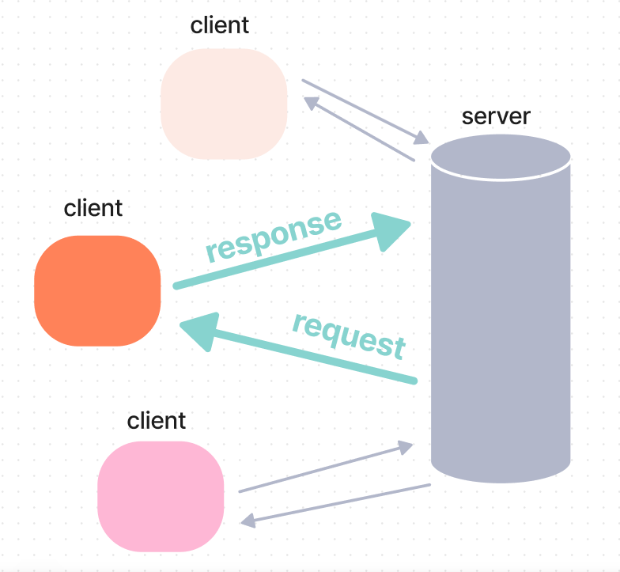

## 2 Theory: What is HTTP
Whenever you decide to check out your friends' pictures on social networks or leave them a message, watch a funny video with kittens, or find the meaning of an unknown term in the search engine, the device (client) from which you surf the Internet sends a request to the server and receives a response from it.

A **client** is a customer of a service, and a **server** is a computer that serves users or other computers. It can be located remotely, tens of thousands of kilometers away from you. The technology when the network load is distributed between servers and service customers is called **Client-Server Architecture**.

Data exchange between the client and the server takes place due to the **HTTP**. HTTP stands for **HyperText Transfer Protocol**. A **protocol** is a set of rules and conventions that defines a uniform way to exchange data between different programs and handle errors. Like a waiter in a restaurant, it accepts your requests, takes them to the server for processing, and then comes back to you with a response.
